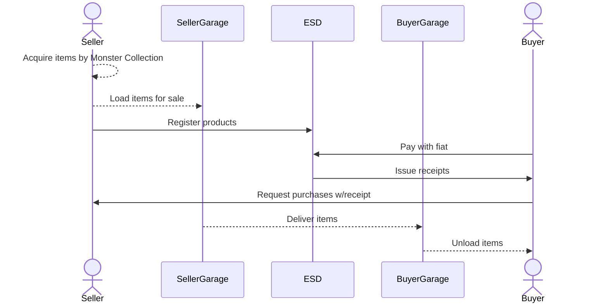
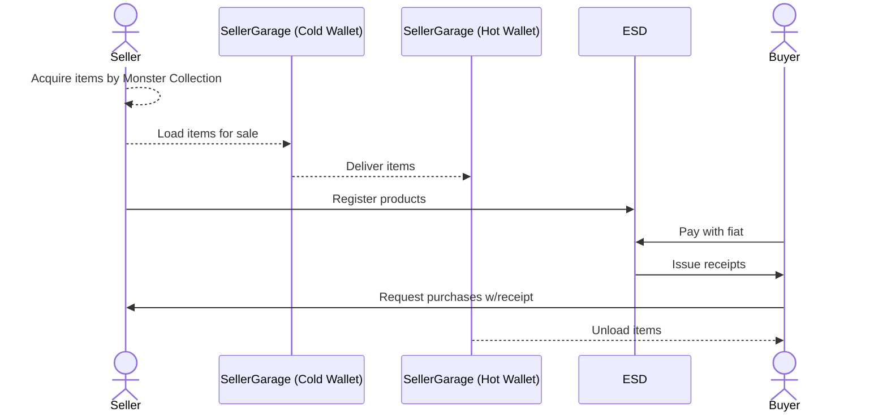

# Abstract

This proposal aims to provide a solution for item transferring. it isn't first proposal for that purpose. [NCIP-4][] already had been proposed almost same purpose in 2021. 

What makes this proposal different is the strategy it takes to reduce risk. unlike NCIP-4, this proposal introduces a new sandboxed channel and new fee token for item transferring. this approach isolate item transferring from the rest part of Nine Chronicles economics, and helps gradual application.

[NCIP-4]: https://docs.google.com/document/d/1YcHchHDYIXchSEleFkYTMgz67h32es9qjSDh_pfcoR0/edit

# Motivation

The main purpose of this proposal is, allowing item transferring safely. "safely" here means that the transfer of the item will not break the rest of the game's ecosystem.

# Rationale
## Item trading considered harmful (in some case)

* Item transferring can be considered in common sense in MMO RPG era, but it might be hard to applying when some entity (game developer or publisher) want to provide assets to gamers directly.
* This can be recognized as monopolizing supply for profitability, but it also has the advantage of simplifying level design by eliminating other considerations in game design.
* Nine Chronicles does not want to supply items exclusively for a specific entity. However, the level design that has been assumed based on exclusive supply-friendly, so it is too risky at the level design level to revise it hastily.

## P2P is still main key for composability
* Nevertheless, the concept that each entity can send and receive items through peer-to-peer is still attractive, because it's a sort of building block to build up more complex concepts.
    * e.g., even before wNCG bridge launching, many users in Nine Chronicles community already had traded NCG and ETH, using very simple `transfer_asset` action.
* The most important thing isn't to break out of exclusive supplier assumption right now, but to provide the building blocks that other players can imagine about and propose improved structures continuously.

## From allowlist, instead of denylist
* As mentioned before, Nine Chronicles is already a complex system of multiple items and systems, so making all items transferable is still a risky choice.
* It's important to be able to participate by clearly disclosing the types and specifications of items that can be transferred, and from that point of view, allowlist is an easier strategy to practice at first.

# Specification
## Concepts
### Garage
* **Garage** is a new inventory to storing items to be transferred.
* Unlike inventory, Garage is associate per account, not character (a.k.a. avatar).
* While items in Garage, they can't be used in game play.

### Load and Garage Token
* **Load** is an action that moving items from inventory to Garage.
* Load can be executed only avatar's owner account.
* For Load items, account to want Load must pays **Garage Token** as fee. 
    * The amount of Garage Tokens to be paid is determined by the following table.

    | Item | Cost |
    | ---- | ---- |
    | AP Potion | 0.16 |
    | Hourglass | 0.0016 |
    | Golden Dust | 1 |
    | Silver Dust | 0.1 |
    | Goldenleaf Runestone | 10 |
    | Crystal | 0.0000001 |

    * Fee table might be treated as chain state. in that case, it can be updated without any hard-fork.
* **Garage Token** is a new token for Garage. 
    * it's intended to be isolated from NCG for sake of economic complexity.
    * it can be earned by Monster Collection level 7+.
    * it will be earned per 100 deposit. (approx 0.1m per week).

### Deliver
* **Deliver** is an action for transmitting items from Garage to other Garage.
* There is no additional cost for Deliver.

### Unload
* **Unload** is an action for moving Garage to inventory.
* Due to nature, Unload requires an address for target avatar.
* Unload doesn't require additional cost too.

## Usecase 1: Simple Off-chain Item Purchase (w/ ESDs, like App Store)

## Usecase 2: More practical Off-chain Item Purchase (w/ ESD, Cold/Hot Wallet)

This case represents two modified things from first one:

1. The seller is using separated/dedicated garages (i.e., Cold/Hot Wallets) to isolate staked account from other transactions than `Stake` / `Claim`. it helps with security, as the stake requirements for obtaining Garage Tokens are pretty high.
2. The seller no more deliver items to buyer's garage, but instead, it unload items to buyer's inventory directly. so buyers don't need to unload themselves manually.

# Backward Compatibility
* This proposal requires additional actions for Garage. thus it requires hard-fork and every nodes in the network must be updated to apply this changes.
* Introduced new states doesn't affect or rely any other existing states. therefore, any additional migration doesn't be needed.
