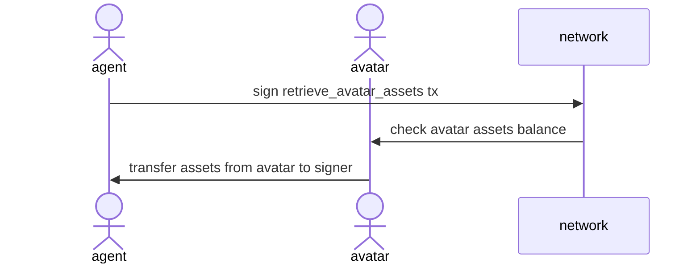

# Abstract

This proposal aims to transfer [FungibleAssetValue] from belong avatar address to agent address.

# Motivation

If a [FungibleAssetValue](i.e, NCG) is sent to an incorrect avatar address instead of agent address(signer), the [FungibleAssetValue] is bound and there is no way to retrieve it. The agent who owns the avatar signs the Tx to take the [FungibleAssetValue] out of the avatar and make it moveable.

# Specification

To simplify, Move the NCG from the avatar address to the agent address through the new action `RetrieveAvatarAssets`.

## `RetrieveAvatarAssets`

The plain value is stored in Dictionary format like other actions. The schema is as follows.
```
{
  "type_id": "retrieve_avatar_assets",              # action type name.
  "values": [
    AvatarAddress                                   # target avatar address from signer will retrieve assets.
  ]
}
```



# Backward Compatibility

* This proposal requires the hard-forks as like below reasons:
  - A new action type `retrieve_avatar_assets` is added, and all nodes need to be updated to interpret the action.
  - `retrieve_avatar_assets` only handles the transfer assets balance using the existing TransferAsset interface and does not require additional migration.

[FungibleAssetValue]: https://docs.libplanet.io/4.0.6/api/Libplanet.Types.Assets.FungibleAssetValue.html
