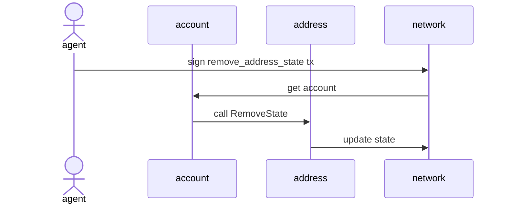

# Abstract

이 제안은 시스템에서 더 이상 사용되지 않는 주소(예: Shop, Ranking, ActivatedAccounts)의 상태를 제거하는 새로운 액션을 제안합니다. 이를 통해 레거시 시스템 주소들의 상태를 정리하여 체인의 상태를 효율적으로 관리할 수 있습니다.

# Motivation

블록체인의 상태 데이터는 지속적으로 증가하며, 이는 노드 운영에 부담이 될 수 있습니다. 특히 제네시스 블록에서 설정된 시스템 주소들 중 일부(Shop, Ranking, ActivatedAccounts 등)는 시스템 업데이트로 인해 더 이상 사용되지 않게 되었습니다. 이러한 레거시 시스템 주소들의 상태는 체인에 불필요한 부담을 주고 있어, 이를 제거할 수 있는 메커니즘이 필요합니다.

# Specification

새로운 액션 `RemoveAddressState`를 통해 특정 주소의 상태를 제거할 수 있습니다.

## `RemoveAddressState`

Plain value는 다른 액션들과 마찬가지로 Dictionary 형식으로 저장됩니다. 스키마는 다음과 같습니다:

```
{
  "type_id": "remove_address_state",                # 액션 타입 이름
  "values": [
    AccountAddress,                                 # 상태를 제거할 대상 account address
    Address                                         # 제거할 상태의 주소
  ]
}
```



이 액션은 `IAccount.RemoveState()` 메서드를 호출하여 해당 주소의 상태를 제거합니다.

# Backward Compatibility

이 제안은 다음과 같은 이유로 하드포크가 필요합니다:
- 새로운 액션 타입 `remove_address_state`가 추가되며, 모든 노드가 이 액션을 해석할 수 있도록 업데이트되어야 합니다.
- `RemoveState` 기능은 기존 `IAccount` 인터페이스의 메서드를 사용하지만, 이를 처리하는 새로운 로직이 필요합니다.

---

# English Version

---
NCIP: 26
Title: Remove States from Address
Status: Draft
Type: Core
Author: Nine Chronicles team <9c-dev@planetariumhq.com>
Created: 2025-06-10
---

# Abstract

This proposal introduces a new action to remove states from addresses that are no longer used in the system (e.g., Shop, Ranking, ActivatedAccounts). This will enable efficient chain state management by cleaning up states from legacy system addresses.

# Motivation

Blockchain state data continuously grows, which can burden node operations. In particular, some system addresses set in the genesis block (such as Shop, Ranking, ActivatedAccounts) are no longer in use due to system updates. The states of these legacy system addresses create unnecessary overhead on the chain, necessitating a mechanism for their removal.

# Specification

A new action `RemoveAddressState` enables the removal of states from specific addresses.

## `RemoveAddressState`

The plain value is stored in Dictionary format like other actions. The schema is as follows:

```
{
  "type_id": "remove_address_state",                # action type name
  "values": [
    AccountAddress,                                 # target account address to remove state from
    Address                                         # address of the state to remove
  ]
}
```


This action calls the `IAccount.RemoveState()` method to remove the state from the specified address.

# Backward Compatibility

This proposal requires hard-forks for the following reasons:
- A new action type `remove_address_state` is added, and all nodes need to be updated to interpret this action.
- While the `RemoveState` functionality uses the existing `IAccount` interface method, it requires new logic for processing.
