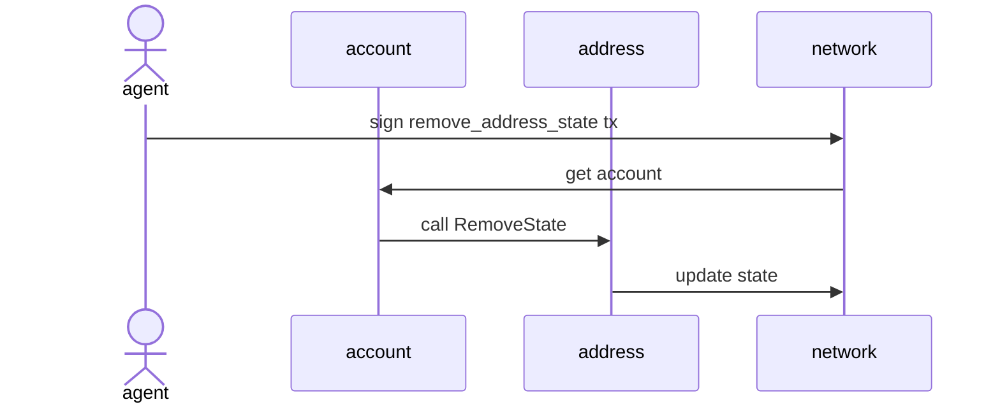

# Abstract

이 제안은 시스템에서 더 이상 사용되지 않는 주소(예: Shop, Ranking, ActivatedAccounts)의 상태를 제거하는 새로운 액션을 제안합니다. 이를 통해 레거시 시스템 주소들의 상태를 정리하여 체인의 상태를 효율적으로 관리할 수 있습니다.

# Motivation

블록체인의 상태 데이터는 지속적으로 증가하며, 이는 노드 운영에 부담이 될 수 있습니다. 특히 제네시스 블록에서 설정된 시스템 주소들 중 일부(Shop, Ranking, ActivatedAccounts 등)는 시스템 업데이트로 인해 더 이상 사용되지 않게 되었습니다. 이러한 레거시 시스템 주소들의 상태는 체인에 불필요한 부담을 주고 있어, 이를 제거할 수 있는 메커니즘이 필요합니다.

# Specification

새로운 액션 `RemoveAddressState`를 통해 특정 주소의 상태를 제거할 수 있습니다.

## `RemoveAddressState`

Plain value는 다른 액션들과 마찬가지로 Dictionary 형식으로 저장됩니다. 스키마는 다음과 같습니다:

```
{
  "type_id": "remove_address_state",                # 액션 타입 이름
  "values": [
    AccountAddress,                                 # 상태를 제거할 대상 account address
    Address                                         # 제거할 상태의 주소
  ]
}
```



이 액션은 `IAccount.RemoveState()` 메서드를 호출하여 해당 주소의 상태를 제거합니다.

### 보안 고려사항

`RemoveAddressState` 액션은 체인에서 상태를 영구적으로 삭제하는 위험한 작업입니다. 한번 삭제된 상태는 복구가 불가능하며, 이는 체인의 무결성에 심각한 영향을 미칠 수 있습니다. 이러한 위험성 때문에 다음과 같은 제한사항이 적용됩니다:

1. 이 액션은 특별히 지정된 관리자 계정만이 실행할 수 있습니다.
2. 관리자 계정 목록은 체인의 정책 설정을 통해 엄격하게 관리됩니다.
3. 모든 상태 제거 작업은 체인에 기록되어 감사가 가능합니다.

따라서 이 액션을 실행하기 전에는 반드시 삭제될 상태의 영향도를 철저히 분석하고, 필요한 경우 `SetAddressState`를 통한 복구 계획을 수립해야 합니다.

## `SetAddressState`

이 액션은 `RemoveAddressState`로 제거된 상태를 복구하거나 새로운 상태를 설정하는 데 사용됩니다. Plain value는 다음과 같은 스키마로 저장됩니다:

```
{
  "type_id": "set_address_state",                   # 액션 타입 이름
  "values": [
    AccountAddress,                                 # 상태를 설정할 대상 account address
    Address,                                        # 설정할 상태의 주소
    Value                                          # 설정할 상태 값
  ]
}
```


This action calls the `IAccount.SetState()` method to set the state at the specified address.

### 보안 고려사항

`SetAddressState` 액션은 주소의 기존 상태를 새로운 상태로 덮어쓸 수 있는 권한을 가지고 있습니다. 이는 다음과 같은 보안 위험을 수반합니다:

1. 기존 상태의 의도하지 않은 손실이 발생할 수 있습니다.
2. 악의적인 상태 변경으로 시스템의 정상적인 동작이 방해될 수 있습니다.
3. 체인의 일관성이 깨질 수 있는 위험이 있습니다.

이러한 위험성 때문에 `RemoveAddressState`와 마찬가지로 다음과 같은 제한사항이 적용됩니다:

1. 이 액션은 특별히 지정된 관리자 계정만이 실행할 수 있습니다.
2. 관리자 계정 목록은 체인의 정책 설정을 통해 엄격하게 관리됩니다.
3. 모든 상태 설정 작업은 체인에 기록되어 감사가 가능합니다.

따라서 이 액션을 실행하기 전에는 반드시 기존 상태와 새로운 상태의 영향도를 철저히 분석해야 합니다.

# Backward Compatibility

이 제안은 다음과 같은 이유로 하드포크가 필요합니다:
- 새로운 액션 타입 `remove_address_state`와 `set_address_state`가 추가되며, 모든 노드가 이 액션들을 해석할 수 있도록 업데이트되어야 합니다.
- `RemoveState`와 `SetState` 기능은 기존 `IAccount` 인터페이스의 메서드를 사용하지만, 이를 처리하는 새로운 로직이 필요합니다.

---

# English Version

---
NCIP: 26
Title: Remove States from Address
Status: Draft
Type: Core
Author: Nine Chronicles team <9c-dev@planetariumhq.com>
Created: 2025-06-10
---

# Abstract

This proposal introduces a new action to remove states from addresses that are no longer used in the system (e.g., Shop, Ranking, ActivatedAccounts). This will enable efficient chain state management by cleaning up states from legacy system addresses.

# Motivation

Blockchain state data continuously grows, which can burden node operations. In particular, some system addresses set in the genesis block (such as Shop, Ranking, ActivatedAccounts) are no longer in use due to system updates. The states of these legacy system addresses create unnecessary overhead on the chain, necessitating a mechanism for their removal.

# Specification

A new action `RemoveAddressState` enables the removal of states from specific addresses.

## `RemoveAddressState`

The plain value is stored in Dictionary format like other actions. The schema is as follows:

```
{
  "type_id": "remove_address_state",                # action type name
  "values": [
    AccountAddress,                                 # target account address to remove state from
    Address                                         # address of the state to remove
  ]
}
```


This action calls the `IAccount.RemoveState()` method to remove the state from the specified address.

### Security Considerations

The `RemoveAddressState` action is a dangerous operation that permanently deletes states from the chain. Once a state is removed, it cannot be recovered, which can significantly impact the chain's integrity. Due to these risks, the following restrictions apply:

1. This action can only be executed by specially designated administrator accounts.
2. The list of administrator accounts is strictly managed through chain policy settings.
3. All state removal operations are recorded on the chain for audit purposes.

Therefore, before executing this action, it is crucial to thoroughly analyze the impact of the state removal and, if necessary, establish a recovery plan using `SetAddressState`.

## `SetAddressState`

This action is used to restore states removed by `RemoveAddressState` or set new states. The plain value is stored with the following schema:

```
{
  "type_id": "set_address_state",                   # action type name
  "values": [
    AccountAddress,                                 # target account address to set state to
    Address,                                        # address of the state to set
    Value                                          # state value to set
  ]
}
```


This action calls the `IAccount.SetState()` method to set the state at the specified address.

### Security Considerations

The `SetAddressState` action has the authority to overwrite existing states of an address with new states. This carries the following security risks:

1. Unintended loss of existing states may occur.
2. Malicious state changes could interfere with normal system operation.
3. There is a risk of breaking chain consistency.

Due to these risks, like `RemoveAddressState`, the following restrictions apply:

1. This action can only be executed by specially designated administrator accounts.
2. The list of administrator accounts is strictly managed through chain policy settings.
3. All state setting operations are recorded on the chain for audit purposes.

Therefore, before executing this action, it is crucial to thoroughly analyze the impact of both existing and new states.

# Backward Compatibility

This proposal requires hard-forks for the following reasons:
- New action types `remove_address_state` and `set_address_state` are added, and all nodes need to be updated to interpret these actions.
- While the `RemoveState` and `SetState` functionalities use existing `IAccount` interface methods, they require new logic for processing.
